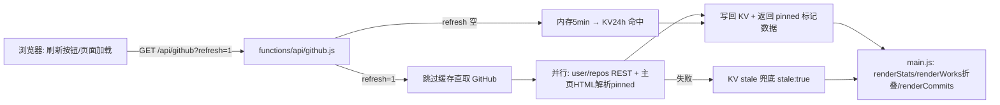

## 产品概述

对个人主页博客的 GitHub 数据展示做两处增强：

1. **刷新按钮**：当前 GitHub 数据（个人统计 / 作品展示 / 最近提交）依赖四级缓存（内存 5min → KV 24h → GitHub 实时 → KV 过期兜底），页面加载失败或数据过旧时用户只能整页刷新且无法绕过缓存。需在"作品展示"模块标题旁增加一个刷新按钮，点击后强制绕过缓存重新拉取 GitHub 数据并更新页面展示。
2. **项目折叠展示**：作品展示区当前渲染全部仓库。改为默认只展示 GitHub 主页上 pin（置顶）的项目，其余仓库默认隐藏，通过"展开更多项目"按钮折叠查看（复用最近提交区的折叠交互模式）。

## 核心功能

- 后端 `/api/github` 支持 `?refresh=1`：跳过内存与 KV 缓存，强制从 GitHub 拉取最新数据，成功后写回 KV；失败时回退 KV 过期兜底数据并告知前端
- 后端抓取 GitHub 主页 HTML 解析 pinned 仓库名单，为仓库列表标记 `pinned` 字段并置前；解析失败不影响其余数据
- 前端"作品展示"模块头部新增刷新按钮：点击触发强制刷新，带旋转加载动画，成功后重渲染统计 / 作品 / 提交，失败弹 toast 提示
- 作品展示默认仅渲染 pinned 项目，非 pinned 项目折叠在"更多项目"按钮后，点击展开/收起

## 技术栈

- 前端：原生 JavaScript（ES Modules）+ HTML + CSS，无框架、无构建步骤
- 后端：Cloudflare Pages Functions（functions/ 目录），Cloudflare KV 持久缓存
- 复用现有模式：`github-contributions.js` 的 fetchText + 正则解析 HTML 先例、`commits-toggle` 折叠按钮交互、`toast.js` 提示

## 实现方案

### 后端（functions/api/github.js）

1. **pinned 仓库解析**：新增 `fetchPinned(env)`，抓取 `https://github.com/{USERNAME}` 主页 HTML，正则解析 pinned 仓库名（`href="/{USERNAME}/{repo}"` 的 pinned 列表区域）。与 user/repos 请求并行执行，单点失败降级为空名单（`pinned` 全部为 false，前端自然走全量折叠逻辑）。为 `repoList` 各项附加 `pinned: true/false`，并按 pinned 优先、pushedAt 倒序排序。
2. **强制刷新**：`onRequestGet` 读取 `refresh` 查询参数；为 1 时跳过内存缓存与 KV 有效缓存，直接走 GitHub 实时拉取分支，成功后写回 KV；拉取失败仍回退 `kvReadStale` 兜底，并在响应中附 `stale: true` 标记，便于前端提示"当前为缓存数据"。

### 前端

1. **api.js**：`getGithub(refresh)` 支持追加 `?refresh=1`。
2. **index.html**：作品展示 `module-head` 右侧新增刷新按钮（SVG 循环箭头图标，含 `aria-label`）。
3. **main.js**：

- `setupGithub()` 与新增 `refreshGithub()` 共用渲染逻辑；刷新时按钮进入 `.is-loading` 旋转态并禁用，成功后调用 `renderStats/renderWorks/renderCommits`，失败 toast 提示
- `renderWorks` 增加折叠状态：默认只渲染 `pinned` 为 true 的仓库；存在非 pinned 仓库时渲染"展开更多项目（N 个）"按钮（复用 commits-toggle 交互模式），点击展开/收起
- 本地兜底 `SITE.works` 渲染行为不变

4. **style.css**：新增 `.refresh-btn`（含 hover 背景、`.is-loading` 旋转动画）、`.works-toggle`（复用 commits-toggle 视觉）、`.works-grid.is-collapsed` 等样式。**严禁显式设置任何 cursor 属性**（全局圆点光标方案，见记忆 86624900），交互反馈一律用背景色 / 透明度 / 旋转动画。

## 架构设计

数据流保持"单请求聚合"不变，仅扩展两个维度：



## 目录结构

```
blog/
├── functions/api/github.js        # [MODIFY] 新增 fetchPinned 解析 pinned 仓库、refresh=1 跳缓存强刷逻辑、repoList 附加 pinned 字段
├── assets/js/api.js               # [MODIFY] getGithub 支持强制刷新参数
├── assets/js/main.js              # [MODIFY] renderWorks 折叠渲染 pinned 优先；新增 refreshGithub 强刷入口与加载态
├── index.html                     # [MODIFY] 作品展示 module-head 增加刷新按钮
└── assets/css/style.css           # [MODIFY] 刷新按钮/折叠按钮样式（禁止显式 cursor）
```

## 实现要点

- **性能**：pinned 解析复用一次 HTML 抓取（与现有缓存体系共同生效，24h 内只抓一次），不增加正常路径请求次数；`?refresh=1` 是用户主动行为，可接受直连 GitHub 的延迟（约 1~2s），期间用按钮旋转态反馈
- **健壮性**：pinned 解析失败返回空名单而非抛错，保证 profile/commits 不受影响；强刷失败回退 stale 数据并明确提示；仓库卡片渲染统一走 `escapeHtml` 防 XSS
- **爆炸半径**：不改动现有缓存结构（KV 键格式与 TTL 不变，旧缓存数据无 pinned 字段时前端按全部折叠处理，平滑兼容）